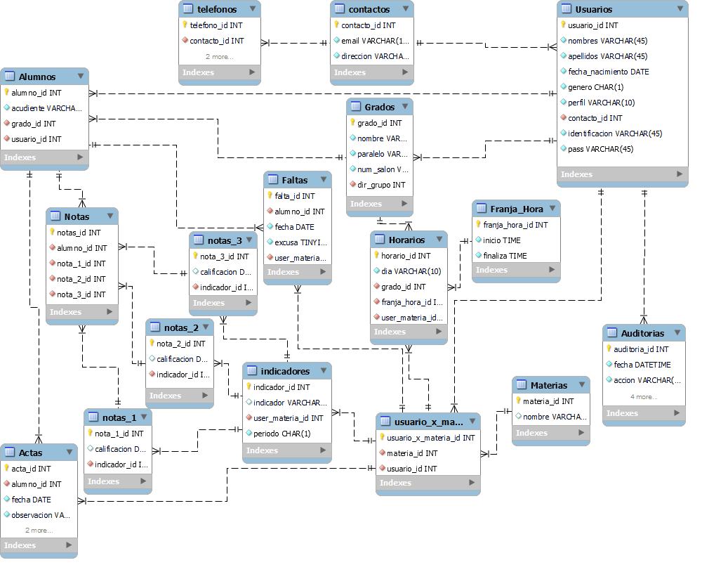

# Base de Datos para un colegio

## Problema:

- Un colegio X necesita sistematizar toda la información que este maneja. A continuación se detallara una descripción de los procesos que este maneja.
El colegio X que se encuentra en la ciudad Y cuenta con cupos para los grados de educación media(sexto - undécimo), estos cursos tienen un máximo de 20 estudiantes por curso, si hay un sobre cupo de un 30% o menos sobre la base de 20 estudiantes se acomodan el curso actual, si el sobre cupo es mayor de un 30% y menor de un 70%, se dividen el total de estudiantes y se reparten en los diferentes salones correspondiente al curso y si es mayor de un 70% se abre un curso con estos estudiantes. Los estudiantes al momento de ingresar al colegio se registrarán con sus nombres, apellidos, genero, fecha de nacimiento, identificación, acudiente, dirección del acudiente, email del acudiente y teléfono del acudiente. 
El colegio cuenta con un cuerpo administrativo, los cuales son los encargados del ingreso de los docentes, alumnos, materias, crear los diferentes grados, vincular los alumnos a los grados, vincular los docentes directores de grupo al grado correspondiente, vincular los docentes a las materias. Tantos los administradores como los profesores se registran al sistema con los siguientes datos: nombres, apellidos, genero, perfil, fecha de nacimiento, identificación, password, email, dirección, teléfonos.
Un docente  puede estar vinculado a mas de una materia, y ser director de grupo de una solo grado, adicional es el encargado de generar las notas por estudiantes, las cuales por periodo(4 en total) serán 3 notas, para definir una nota el docente tendrá su propio criterio y definirá un indicador por nota establecida. Un materia en el periodo se “pierde” si la definitiva(el promedio de las 3 notas) es menor a 3.5, si al final del año escolar el promedio de las 4 definitivas es menor de 3.5 se pierde la materia y se tendría que habilitar. Se pueden habilitar máximo 5 materias, mas de eso el estudiante pierde el año. El docente también tendrá que registrar las inasistencias del estudiante y si este cuenta con una excusa, registrar actas donde el estudiante haya faltado a las políticas del colegio, se registrara el estudiante que haya incumplido, la fecha, la observación, y los compromisos del estudiante.
Cada grado estará vinculado a un horario de clases (lunes  a viernes) el cual cuenta con tres franjas horarias que van de 7 am a 9 am, de 9:30 am a 11 am, y de 11:15 a 12:30.
Adicional se quiere implementar un sistema para auditar los cambios que se realicen, por quien fue hecho, cuando se hizo, y guardar la información antes de editar o eliminar

## Listado de entidades

### Materias

- materia_id **(PK)**
- nombre

### Contactos

- contacto_id **(PK)**
- email 
- direccion

### Usuarios

- usuario_id **(PK)**
- nombres
- apellidos
- fecha de nacimiento
- genero
- perfil
- identificacion
- pass
- activo
- contacto_id **(FK)**

### Grados

- grado_id **(PF)**
- nombre
- paralelo
- numero de salon
- dir_grupo **(FK)**

### Franja_Hora

- franja_hora_id **(PK)**
- inicio
- finaliza

### Usuario_X_Materia

- usuario_x_materia_id **(PK)**
- materia_id **(FK)**
- usuario_id **(FK)**

### Horarios

- horario_id **(PK)**
- dia
- grado_id **(FK)**
- franja_hora_id **(FK)**
- usuario_x_materia_id **(FK)**

### Indicadores

- indicador_id **(PK)**
- indicador
- periodo
- usuario_x_materia_id **(FK)**

### Notas_1

- nota_1_id **(PK)**
- calificacion
- indicador_id **(FK)**

### Notas_2

- nota_2_id **(PK)**
- calificacion
- indicador_id **(FK)**

### Notas_2

- nota_2_id **(PK)**
- calificacion
- indicador_id **(FK)**

### Alumnos

- alumno_id
- acudiente
- grado_id **(FK)**
- usuario_id **(FK)**

### Notas

- nota_id **(PK)**
- alumno_id **(FK)**
- nota_1_id **(FK)**
- nota_2_id **(FK)**
- nota_3_id **(FK)**

### Faltas

- falta_id **(PK)**
- fecha
- excusa
- alumno_id **(FK)**
- usuario_x_materia_id **(FK)**

### Actas

- acta_id **(PK)**
- fecha
- observaciones
- compromisos
- alumno_id **(FK)**
- usuario_x_materia_id **(FK)**

### Telefonos

- telefono_id **(PK)**
- numero
- tipo
- contacto_id **(FK)**

### Auditorias

- auditoria_id **(PK)**
- fecha
- accion
- tabla
- anterior
- nuevo
- usuario_id **(FK)**

## Relaciones

- Un **Contacto** pertenece a un **Usuario** (_1 a 1_).
- Un **Telefono** esta contenido en **Contacto** (_1 a 1_).
- Un **Alumno** es un **Usuario** (_1 a 1_).
- Un **Usuario** puede dar muchas **Materia** (_M a M_).
- Un **Grado** tiene muchos **Alumnos** (_1 a M_).
- Un **Horario** pertenece a un **Grado** (_1 a 1_).
- Un **Horario** cuenta con muchas **Franja_hora** (_1 a M_).
- Un **Horario** contiene muchos **Usuario_X_Materia** (_1 a M_).
- Un **Indicador** contiene a un **Usuario_X_Materia** (_1 a 1_).
- Un **Indicador** le pertenece a muchas **Nota** (_1 a 1_).
- Un **Alumno** puede tener muchas **Actas** (_1 a M_).

## Modelo Relacional de BD

